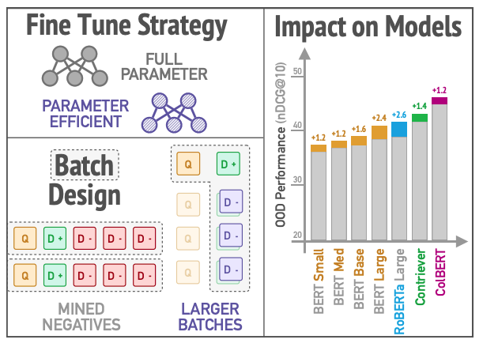

# simple-recipe-to-improve-OOD

This repository contains the code for ```A Simple Recipe for Improving Out-of-Domain Retrieval in Dense Encoders```



We divide the files by the dense retriever architectures we experiment over: asymmetric, symmetric, and late interaction.
For each, the code base is from [DPR](https://github.com/facebookresearch/DPR), [contriever](https://github.com/facebookresearch/contriever), and [Colbert](https://github.com/stanford-futuredata/ColBERT), as we follow the architectural design from each model. 

To reproduce our results, take the following steps:

## Dataset
### Train Dataset
* [MSMARCO](https://microsoft.github.io/msmarco/)
* [NQ](https://github.com/facebookresearch/DPR)
### Test Dataset
* [Beir](https://github.com/beir-cellar/beir)

### Negative Sampling
* [MSMARCO](https://microsoft.github.io/msmarco/)
* Random
* BM25
* self-distillation
* self-distillation with denoising step
* [RocketQA](https://github.com/PaddlePaddle/RocketQA)

## Train / Inference
details of how to run the models are under each folder:
* [asymmetric](https://github.com/amy-hyunji/simple-recipe-to-improve-OOD/blob/main/asymmetric/README.md)
* [symmetric](https://github.com/amy-hyunji/simple-recipe-to-improve-OOD/blob/main/symmetric/README.md)
* [late-interaction](https://github.com/amy-hyunji/simple-recipe-to-improve-OOD/blob/main/late-interaction/README.md)
